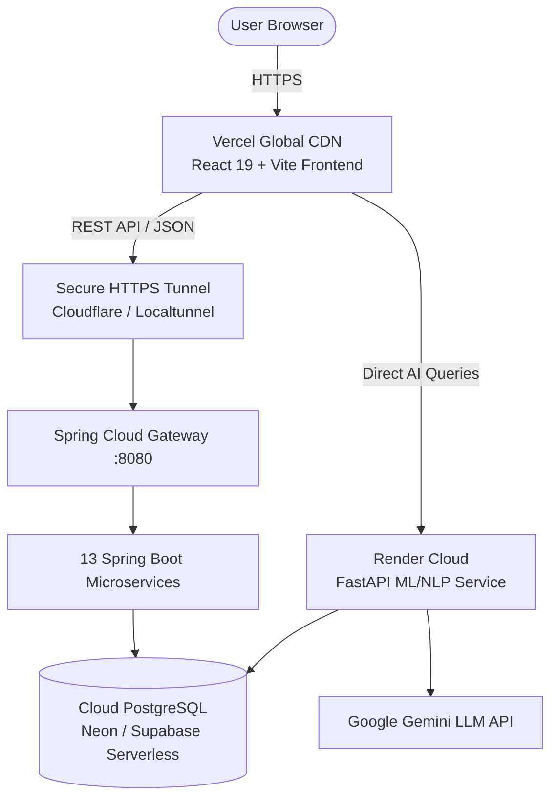

# 🚀 VisionPath-V1 Production Deployment Guide

This guide maps the complete hybrid cloud architecture for **VisionPath-V1**:
- 🌐 **Frontend:** Vercel (Global Edge CDN, React 19 + Vite)
- 🧠 **AI & ML Engine:** Render Cloud (FastAPI + Uvicorn + Scikit-Learn + Gemini)
- 🗄️ **Cloud Database:** Neon Serverless PostgreSQL / Supabase (Free AWS Cloud DB)
- ⚙️ **Backend & Gateway:** Spring Boot 3 & Spring Cloud Gateway (Java 21) with Cloudflare/Localtunnel
- 🐳 **DevOps & CI/CD:** GitHub + Docker Compose automated continuous deployments

---

## Architecture Overview



---

## Phase 1: Push Code to GitHub

Make sure your project is committed and pushed to your GitHub repository:

```bash
git add .
git commit -m "feat: setup deployment configurations for Vercel and Render"
git push origin main
```

---

## Phase 2: Deploy AI & Machine Learning Engine to Render

1. Go to [Render.com](https://render.com) and log in.
2. Click **New +** ➔ **Web Service**.
3. Connect your GitHub repository (`Vision-Path-V1`).
4. Configure the service settings:
   - **Name:** `visionpath-ml-service`
   - **Root Directory:** `visionpath-ml-service`
   - **Environment:** `Python 3` (or choose `Docker`)
   - **Build Command:** `pip install -r requirements.txt`
   - **Start Command:** `uvicorn main:app --host 0.0.0.0 --port $PORT`
   - **Plan:** Free
5. Add **Environment Variables**:
   - `GEMINI_API_KEY` = `your_google_gemini_api_key`
   - `GEMINI_MODEL` = `gemini-1.5-flash`
6. Click **Deploy Web Service**.
7. Once deployed, copy your Render URL:
   `https://visionpath-ml-service.onrender.com`

---

## Phase 3: Setup Cloud PostgreSQL Database (Neon / Supabase)

> **Note:** VisionPath uses PostgreSQL. The managed serverless cloud equivalent of TiDB is **Neon Serverless PostgreSQL** (AWS infrastructure) or **Supabase**.

1. Go to [Neon.tech](https://neon.tech) (or [Supabase.com](https://supabase.com)) and create a free project named `visionpath-db`.
2. Copy your PostgreSQL connection details:
   - **Host:** `ep-xyz.aws.neon.tech`
   - **Port:** `5432`
   - **Database:** `neondb`
   - **Username:** `neondb_owner`
   - **Password:** `your_password`
   - **SSL Mode:** `require`
3. In your microservices `application.properties` (or environment variables), set:
   ```properties
   spring.datasource.url=jdbc:postgresql://ep-xyz.aws.neon.tech:5432/neondb?sslmode=require
   spring.datasource.username=neondb_owner
   spring.datasource.password=your_password
   ```

---

## Phase 4: Expose Backend Microservices & API Gateway

Because 13 Java Spring Boot microservices require ~2GB+ of memory (exceeding typical free cloud limits), run your backend services locally or inside Docker, and expose the **API Gateway (port 8080)** via an encrypted HTTPS public tunnel.

### Option A: Cloudflare Tunnel (Recommended, fast & permanent)
1. Download `cloudflared` or run:
   ```bash
   npx cloudflared tunnel --url http://localhost:8080
   ```
2. Cloudflare will give you a public HTTPS URL:
   `https://your-domain.trycloudflare.com`

### Option B: Localtunnel
```bash
npx localtunnel --port 8080 --subdomain visionpath-api
```
Your public gateway URL will be:
`https://visionpath-api.loca.lt`

---

## Phase 5: Deploy Frontend to Vercel

1. Go to [Vercel.com](https://vercel.com) and log in with GitHub.
2. Click **Add New...** ➔ **Project**.
3. Import your GitHub repository (`Vision-Path-V1`).
4. Configure Project:
   - **Root Directory:** Click Edit and select `visionpath-frontend`
   - **Framework Preset:** `Vite`
   - **Build Command:** `npm run build`
   - **Output Directory:** `dist`
5. Expand **Environment Variables** and add:
   - `VITE_API_BASE_URL` = `https://visionpath-api.loca.lt` (or your Cloudflare tunnel URL)
   - `VITE_FASTAPI_URL` = `https://visionpath-ml-service.onrender.com`
6. Click **Deploy**.

Vercel will build and assign your live production URL (e.g. `https://visionpath.vercel.app`) with edge caching and SSL!
The bundled `vercel.json` ensures client-side routing works seamlessly when pages are refreshed.
